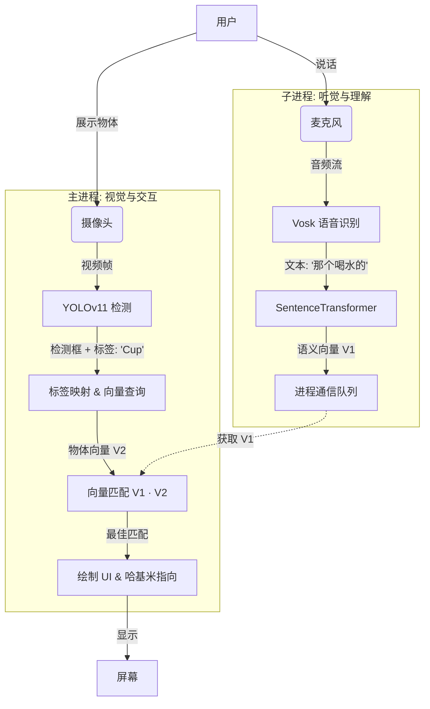

# 🐱 哈基米之萝卜-纸巾难题：多模态交互 AI 实验报告

> **摘要**：  
> 本项目并非简单的“物体识别器”，而是一次关于**人机共生**的严肃探索（顺便撸猫）。我们构建了一个名为“哈基米”的虚拟智能体，它不仅拥有基于 YOLOv11 的“鹰眼”，还搭载了 Vosk 的“顺风耳”，更重要的是，它通过 SentenceTransformers 获得了一颗能理解人类模糊指令的“大脑”。这是一个关于如何让代码听懂“那个喝水的家伙”并准确指向一只杯子的故事。

---

## 1. 🌍 背景：当“萝卜”遇见“纸巾”

在人工智能的宏大叙事中，我们常被问到一个终极问题：*“AI 能帮我找眼镜吗？”*

现有的目标检测系统（如 YOLO）擅长将世界通过一个个矩形框（Bounding Box）进行结构化，它们能精准地告诉你 `[234, 45, 678, 900]` 处有一个 `cup`。然而，人类的语言是混沌且充满隐喻的。我们不会说“请定位标签为 cup 的对象”，我们会说“**嘿，把那个喝水的家伙给我**”。

本项目 **Hajimi AI** 旨在解决这一**语义鸿沟 (Semantic Gap)**。我们创造了一个居住在屏幕左下角的虚拟代理“哈基米”，它不仅能看见世界，还能理解你那不着边际的指令，并用它的小爪子为你指点迷津。

---

## 2. 📚 相关工作与技术栈

本项目站在了巨人的肩膀上，融合了计算机视觉、语音识别与自然语言处理三大领域的开源成果：

*   **👁️ 视觉皮层 (Vision)**: [Ultralytics YOLOv11](https://github.com/ultralytics/ultralytics)
    *   *作用*：提供毫秒级的实时物体检测能力。
    *   *地位*：目前最先进的实时检测模型之一，我们的“眼睛”。
*   **👂 听觉中枢 (Audio)**: [Vosk API](https://alphacephei.com/vosk/)
    *   *作用*：离线中文语音转文本。
    *   *特点*：无需联网，隐私安全，且对中文支持友好。
*   **🧠 语义理解 (NLP)**: [SentenceTransformers](https://www.sbert.net/)
    *   *模型*：`paraphrase-multilingual-MiniLM-L12-v2`
    *   *作用*：将文本转化为高维向量。它是连接“图像标签”与“语音指令”的桥梁。
*   **🖥️ 交互界面 (GUI)**: [CustomTkinter](https://github.com/TomSchimansky/CustomTkinter)
    *   *作用*：抛弃了 Tkinter 那个上世纪 90 年代的灰扑扑外观，提供了现代化的深色模式 UI。

---

## 3. ⚙️ 硬核技术点：跨模态语义对齐

本项目的核心魔法在于**如何让“声音”匹配“图像”**。

### 3.1 向量化的一切
计算机无法直接比较字符串 "Cat" 和 "一只猫"。我们将一切转化为数学。
*   **预计算**：系统启动时，将 YOLO 能识别的 80 类物体标签（如 `cup`, `mouse`, `keyboard`）翻译为中文，并通过 Transformer 模型映射为 384 维的**语义向量**。
*   **实时计算**：当用户说话时，Vosk 捕捉音频并转录为文本，同样的 Transformer 模型将其转化为**指令向量**。

### 3.2 余弦相似度匹配
我们在高维空间中计算“指令向量”与当前画面中所有“物体标签向量”的**点积（Dot Product）**或**余弦相似度**。
*   用户说：“**那个用来打字的东西**”
*   系统计算相似度：
    *   VS `键盘` (Keyboard): **0.85** ✅
    *   VS `鼠标` (Mouse): 0.45
    *   VS `杯子` (Cup): 0.12
*   **结果**：哈基米指向键盘。

### 3.3 多进程架构 (Multiprocessing)
为了保证丝滑的体验，我们拒绝了单线程的卡顿。
*   **主进程 (Main)**：负责渲染 UI、运行 YOLO 检测、绘制画面。FPS 是它的生命线。
*   **子进程 (Child)**：承载 Vosk 和 BERT 模型。因为语音识别和语义推理是 CPU 密集型且具有阻塞性的任务，我们将它们隔离。
*   **通信**：使用 `multiprocessing.Queue` 进行跨进程通信。子进程一旦听懂了你的话，就扔一个向量给主进程，主进程在下一帧渲染时立即响应。

---

## 4. ⛓️ 数据流水线 (Pipeline)

1.  **感知**：摄像头捕获光子，麦克风捕获声波。
2.  **推理**：
    *   视觉流以 ~30FPS 运行，不断刷新世界的状态列表。
    *   听觉流异步运行，随时准备捕获新的指令。
3.  **融合**：主循环每一帧都会检查是否有新的语音指令，并将其与当前的视觉状态进行**语义碰撞**。
4.  **执行**：一旦锁定目标，UI 层面的“哈基米”图像坐标被更新，绘制一条指向目标的绿色箭头，完成交互闭环。

---

## 5. 📝 总结与展望

**Hajimi AI** 是一个看似呆萌实则硬核的实验。它证明了在消费级硬件上，通过组合现有的开源 SOTA (State-of-the-art) 模型，我们可以构建出具有一定“常识理解”能力的交互系统。

它不再是冷冰冰的 `if text == "cup": find_cup()`，而是具有了模糊推理能力的智能体。

**未来展望**：
*   **LLM 加持**：引入小型本地大语言模型（如 Qwen-Nano），让哈基米不仅能指东西，还能吐槽你的桌面太乱。
*   **动作捕捉**：让哈基米不仅是张图片，而是一个 Live2D 模型，随着你的头部动作摇头晃脑。
*   **物联网控制**：当你指着灯说“关掉它”，哈基米通过 HomeAssistant 真的把灯关了。

---
*Generated by Trae AI Assistant*
